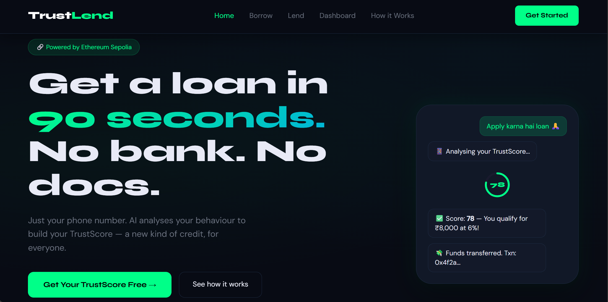
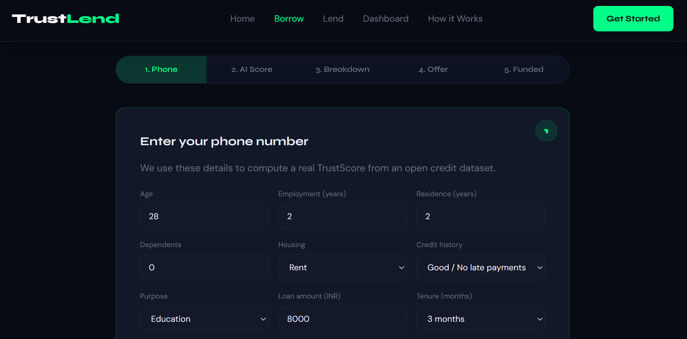
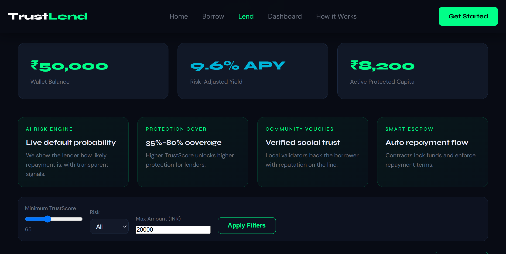

# 🚀 TrustLend

### AI-Powered Decentralized Lending Platform

Secure peer-to-peer lending powered by machine learning trust scoring and blockchain-based smart contracts.

---

## 📸 Project Preview

### 🏠 Landing Page

### 🤖 Borrower Portal & AI Trust Score

### 💰 Lender Marketplace

---

## 🌟 Overview

TrustLend is a decentralized lending platform built for the Nakshatra Hackathon. The platform enables borrowers and lenders to connect directly without relying on traditional banking systems.

Instead of requiring extensive financial history or documentation, TrustLend generates an AI-powered Trust Score using behavioral and financial signals. Loan requests can then be funded through a marketplace and secured using blockchain-based smart contracts.

---

## ✨ Key Features

* 🤖 AI-powered Trust Score generation
* 📊 SHAP-style explainable score breakdown
* 🔗 Blockchain-backed loan agreements
* 💰 Peer-to-peer lending marketplace
* 📈 Borrower and lender dashboards
* 🏦 Smart contract based loan execution
* ⚡ FastAPI backend with machine learning integration
* 📱 Responsive web interface

---

## 🛠 Tech Stack

| Layer            | Technology                  |
| ---------------- | --------------------------- |
| Frontend         | HTML, CSS, JavaScript       |
| Backend          | FastAPI, Python             |
| Machine Learning | Scikit-learn, Pandas, NumPy |
| Blockchain       | Solidity, Polygon Mumbai    |
| Smart Contracts  | Loan Escrow Contracts       |

---

## 🎯 Hackathon Use Case

Many individuals lack access to formal banking and credit history. TrustLend addresses this challenge by using AI-generated trust scoring and blockchain-based transparency to help lenders make informed decisions while providing borrowers with easier access to capital.

---
